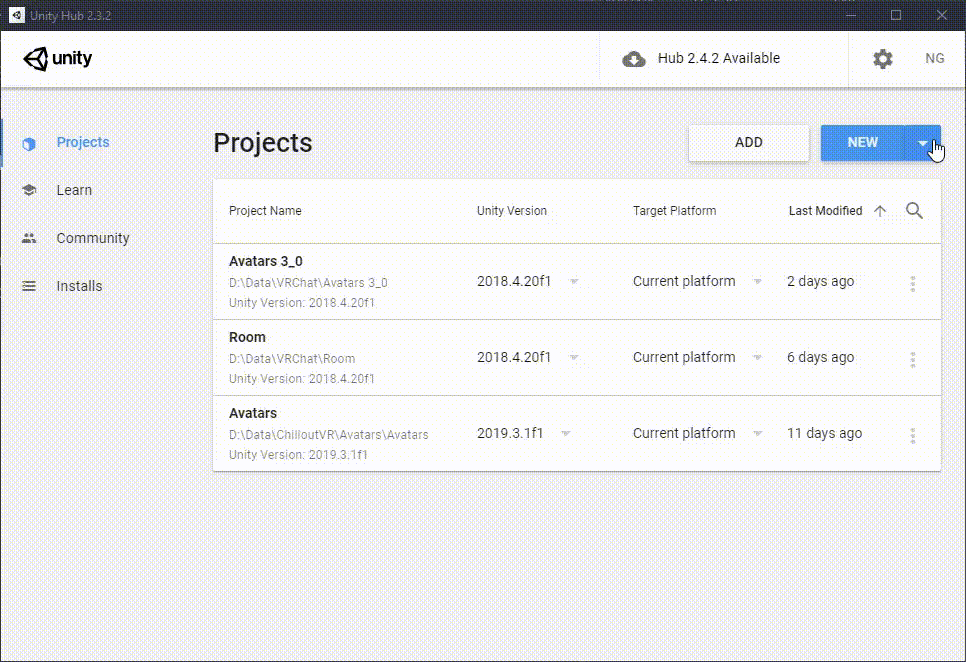
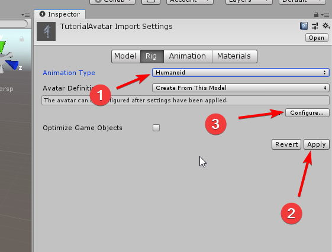
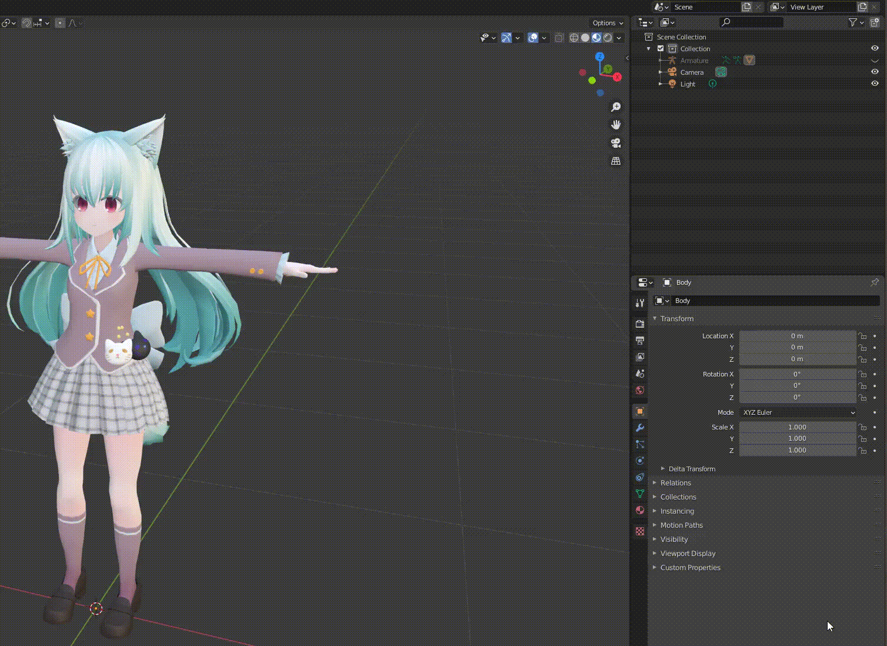

# Nara's VRC Avatar Tutorial

This is a small tutorial I thought about writing. I always disliked video tutorials because I had to rewind to certain timestamps and sometimes you just gotta vibe to some music.

Chapters 1, 2 and 3 are the basics. These should help you get familiar with both Unity and Blender and get you ready for the fun part, kitbashing your own avatar together!

## 1. Requirements

- Unity 2018.4.20f1.
  I recommend installing it via [Unity Hub](https://unity3d.com/get-unity/download). Then install [Unity itself via this link](unityhub://2018.4.20f1/008688490035).
- [Blender](https://www.blender.org/download/) (version 2.80 or higher)
- [Cats Blender Plugin](https://github.com/GiveMeAllYourCats/cats-blender-plugin)

---

## 2. Setting up the Unity project

First we need to set up the work space. Open up Unity Hub and create a new project with Unity version 2018.4.20f1.
Give it a descriptive name like `VRCAvatars` and save it to a memorable location.

After creating the project, the Unity editor will display an empty scene.

Download [VRChat's SDK3 for Avatars](https://vrchat.com/home/download).
After downloading, open it to load it into the Unity project.

### 2.1. Recommended folder structure (optional)

Everyone has their own way of organising their project.
This is a suggestion on how to set up the folders to make working with Blender (and possibly Git if want to use that) easier.
Folders are in **bold** and files are in *italics*.
Don't worry about the files, they are examples of what kind of files you are going to put there.

- **Assets** (this folder is made by Unity)
  - **Avatars**
    - **MyAvatar1** (put your own name here)
      - *MyAvatar1.fbx*
      - **.blender** (you probably need to make this folder in your file browser)*
        - *MyAvatar1.blend*
      - **Materials**
        - *texture.png*
        - *material.mat*
      - **Animations**
        - *default_dance.anim*
        - *anim_controller.controller*

> [*] A folder starting with a `.` is ignored by Unity.
This is useful if you want your `.blend` file to be near the rest of your project, but not want it to be imported into Unity.
Importing blender files is not recommended.

### 2.2 Source control (optional)

Creating (or kitbashing) your own avatar is hard and you will most likely screw things up.
Making backups of Blender projects is easy, but Unity is a whole other beast.
If you want to get into some hardcore content creation it's suggested to use some kind of backup system, like Git!
If you just want to experiment a bit and you have never used Git, you can probably just skip this step.

You can install [Git from here](https://git-scm.com/downloads).
_something something git i'm too lazy for the rest_

---

## 3. Your first avatar

This section will explain how to edit an avatar and prepare it to be used in Unity to upload it to VRChat.
It will go trough the workflow of loading in a model into Blender and exporting it to Unity.

### 3.1. Getting the files

First of all you need something to upload.
There are various sites to get 3D models from.
I recommend [booth.pm](https://booth.pm), however most of the assets are paid and it does require some Google translating.
If you are too lazy to look around [here's](https://booth.pm/en/items/1349366) a free avatar that you can use.

Most assets you download come in `.zip` or `.rar` files.
If you have trouble opening them, I recommend using [7zip](https://www.7-zip.org/).
You still might have trouble opening Japanese zip-files.
There are various other tools for this, just Google around.

After you got the file, save and unzip it somewhere memorable.
Don't put it in your Unity project, you want to keep it free of random assets you only use for Blendering.

You'll get various files. There's always some kind of model file (`.fbx`, `.pmx`, `.pmd`, `.blend`) and textures (`.png`, `.bmp`, `.jpg`, `.psd` if you're lucky).

### 3.2. Loading models in Blender

Start blender and click outside the small splash screen to get rid of it.
If you haven't installed Cats Blender Plugin, do it now!

Select the cube (left mouse button) in the centre and delete it using `X`- or `Del`-key.

#### 3.2.1. **Importing a model**

Now you can load up a model using CATS. Open up the side bar using `N`. Click on the CATS tab and hit `Import Model`. Browse to the folder where you unzipped the model and select the 3D model. After it loads in click `Fix model` to get it to show properly.

#### 3.2.2. **Saving and exporting a model**

If you can see the model with its textures you have made some good progress.
Lets save it so we don't lose it!
Use the `File` menu in the top left or use `Ctrl+S` to save it.
If you are using the earlier mentioned folder layout, put it in the `.blender` folder.
Now to get it into Unity, use the export model button in CATS and save it somewhere in the Unity project.

#### 3.2.3. **Setting up the .fbx**

In the Unity project view, go to where you saved the `.fbx` file.
Select the `.fbx` and in the Inspector go to the Rig tab.
Change the animation type from Generic to Humanoid and click apply.

Next click configure to set up the avatar definitions.
The inspector will change to a different view with 4 tabs in the mapping section: Body, Head, Left Hand, and Right Hand.
Make sure that the Upper Chest is left empty (`None (Transform)`) and that in the Head tab Jaw is left empty as well.
Click Done if everything is good.

#### 3.2.4. **Fixing materials**

If you drag the `.fbx` into the scene you will notice that the model will not have any textures.
This is because model file references texture files that are not included in the project.

Click on the `.fbx` file in the Project viewer and go to the materials tab.
You see that it has a section named `Remapped Materials`.
We want to create a new material for each of them.
You can hit the lock icon in the top right of the inspector to lock the window to the same item.
Then assign the newly created materials to the model.

Now we have the different materials we need to dig around a bit to find the textures.
You can probably find them in a seperate texture folder in the `zip` file containing the model.
Just drag them into the Unity project.
It's also useful to rename them to similar names as the material.

Now we have the textures, we need to set up the materials with these textures.
For each material, drag in the the texture to the Albedo slot.

#### 3.2.5. **Fixing materials in Blender (optional)**

A problem now is that the if we edit the textures in the Unity project, it won't show in Blender.
We can change this by modifying and cleaning up the shaders.

In Blender, go to the shading tab.
In the hierarchy on the right, expand the Armature and select he body.
The window below the 3D view shows the shading graph and describes how something is drawn in Blender.
We want to redo this, so select everything and delete it.
Next add a Material Output, a Diffuse Shader and a Image Texture node using `Shift+A`.

You can select the other materials using the slot button above the shader graph window or by clicking the material.
After this, changes in the textures are shown in both Unity and Blender.
Don't forget to save after you're done.

#### 3.2.6. **Mouth movement and eyes**

Depending on where you get your avatar from, you might not get all the movements (blendshapes) for lip sync.
Lip sync allows the mouth of your model to move when you talk in game.
If you are using the Shapell model this step can be skipped, but it's useful if you are using any other model.
The easiest way to check if the avatar has all the required blendshapes for lip sync is to select the Body in the hierarchy and check the object data properties.

If they aren't there you need to generate them.
Cats provides a tool under the tab visemes.
Select the `Ah`, `Oh`, and `Ch` (or `Ih`) blendshapes and click generate. They should now be generated and visible in the object data properties.

Setting up proper eye tracking is also quite easy.
Under the Eye Tracking tab in CATS you select the Head, Left eye and Right eye.
Most models come with a shape key that blinks both eyes, so check the box that disables eye blinking.
Finally click `Create Eye Tracking`.

#### 3.2.7. **Setting up the avatar for VRChat**

In Unity, select the avatar in the hierarchy on the left.
Add the `VRC Avatar Discriptor` by clicking Add Component in the Inspector.

Open up the View tab and hit `Edit` on the View Position.
Move the view to just below the eyes and close to the face.
You can use the perspective front view to align it better.

Open up the LipSync tab and hit auto detect.
If the mode is not on 'Viseme Blend Shape' then something went wrong in the previous section.

Open up the Eye Look tab and hit enable.
In the Eyes section, selectt both the left and right eye.
Next is to set up the maximum rotation of the eyes.
The rotations are done from the perspective of the character.

#### 3.2.8. **Uploading to VRChat**

In Unity, go to the VRChatSDK tab on the top left and show the Control Panel.
This panel can be docked the editor if you want to keep your workspace clean.
Log in using your VRChat credentials.
Swap to the builder tab, and there might be a few problems.
Most of these can be autofixed.

You are now ready to upload your (first?) avatar.
Click on the `Build & Publish for Windows` button at the bottom of the control panel and follow the instructions.
Building and uploading the avatar might take a while depending on the performance of your PC.

---

## 4. Editting an avatar

This sections will explain various methods to modify your avatar. I'll try to notate the difficulty of each subsection, but it might not be very accurate.

### 4.1. Shaders (very easy)

Some people might prefer the look of Unity's standard shader. However if you want a more cartoony look or maybe more options to tweak with, there are various other shaders to pick from.

There various places where you can get your shaders. If you want some VRChat compatible shaders, take a look at the [VRCat forums](https://vrcat.club/forums/tutorials-and-tools.6/).

If you're lazy here are some free shaders I recommend:

- [Poiyomi's Toon Shader](https://github.com/poiyomi/PoiyomiToonShader)
- [Silent's Cel Shading Shader](https://gitlab.com/s-ilent/SCSS)
- [Xiexe's Unity Shaders](https://github.com/Xiexe/Xiexes-Unity-Shaders)

Changing shaders is quite simple.
Select the material and change the shader at the top of the inspector.
However, getting your look good might require some experimenting.

### 4.2. Modifying Textures (very easy)

One of the most easiest way to add some flair to your avatar is to change some textures.
Just open one of the textures in with your favorite editor and go wild.

### 4.3. Adding rigid accessories (easy)

Adding small rigid accessories like glasses is pretty easy in Blender.
Rigid models don't have any bones and armatures
Import accessory using CATS and use fix model, similarly to when you import a new model in the first part of the tutorial.
Move the mesh to the place where you want it to be.
Next use the Attach Mesh under the Custom Model Creation in CATS.

TODO: _add GIF._

If you want this accesory to be toggleable, you will need to do it in Unity.
If the format isn't `.fbx` you might need to follow the steps in section 3.2 to export it as `.fbx` and get the materials right.
After you got the accesory you can simply drag it into unity and align it in the editor.
Make sure the accesory is under the right item in the hierarchy.
For example, sunglasses would be parented under the head.

TODO: _add GIF._

### 4.4. Adding clothes or flexible accessories (normal)

Adding clothes is very similar to the previous section.
In Blender, import the clothing model and hit fix model.
Make sure you have the armature of the clothing selected and not the mesh.
If you don't trust yourself you can lock the transform of the mesh by going to the Item tab and hitting the lock icons.

Next move (`G`) and scale (`S`) the armature to the correct place.
If it does not fit perfectly i.e. you can see some of the skin poking through the clothing, don't worry about it, it can be fixed.
If the armataures don't line up perfectly go into pose mode of the clothing and folow section 4.6.

TODO: _add GIF._

Once you're happy, use the `Merge Armatures` option in CATS under Custom Model Creation.
Make sure the base model is set to the correct armature!

### 4.5. Fixing clipping the easy way (normal)

Sometimes the clothes don't fit perfectly which makes some of the skin clip trough the clothes.
There are a few solutions to this.

1. Delete parts of the skin so nothing can clip trough the clothes.
2. Move the underlying skin further inwards.
3. Move the clothing further away from the skin.

Personally I prefer to go for option 3 since it allows you to try out different outfits more easily.

TODO: make tutorial about using Blender to modify geomtry.

### 4.6. Changing the length of limbs

TODO

**Whenever you make changes to the armature in Blender, make sure to update the pose of the avatar by clicking Pose on the botten and resetting and enforcing T-pose.**

### 4.x. Creating toggle animations

TODO

---

## 5. Improving Performance

This section is very important if you don't want to get performanced block by most people.

### 5.1. Avatars and your FPS

There are various elements that can reduce the performance of your avatar.
Funilly enough, even though VRChat is a VR game, the largest bottleneck is on the CPU.
This is because a lot of elements run on a single thread on your CPU.

One of the two main CPU performance hoarders is Dynamic Bones.
Reducing the amount of bones affected by physics from 200 to 10 will greatly help in maintaining high fps in busy lobbies.
Regarding dynamic bone colliders, don't use them.
You don't need them.

The second offender is material count.
For every material your CPU needs to send instructions to your GPU, which takes precious time.
The more materials, the longer your CPU is idling around doing nothing useful.
The only reason for needing materials is if you actually need different shaders for different parts.
However, this can easily be fixed by being smart with your shaders.

### 5.2. Automatic material combining (easy)

TODO

### 5.3. Manual material combining (hard)

TODO

### 5.4. Reducing tris count using decimation (easy)

TODO

### 5.5. Reducing tris count manually (hard)

TODO

### 5.6. Dynamic bones via constraints (easy)

TODO

### 5.7. Reducing dynamic bones by merging (normal)

TODO

---
